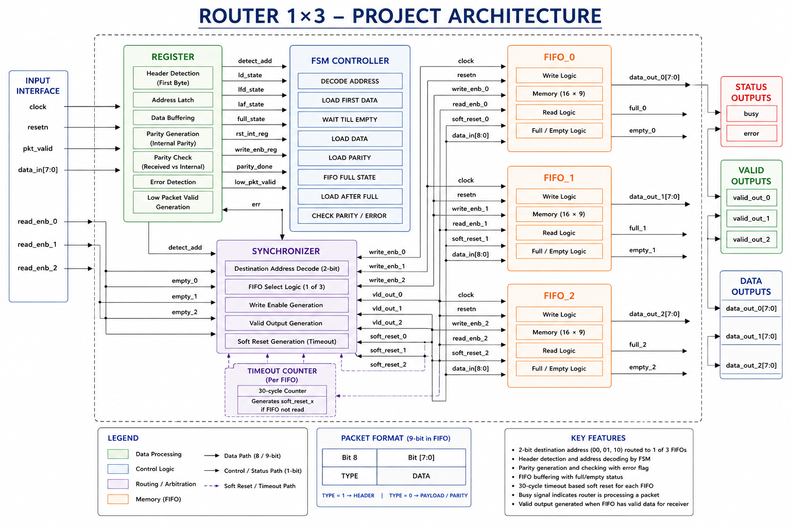
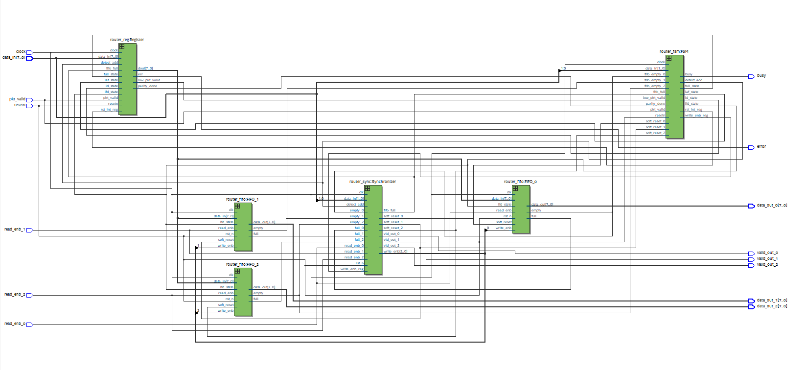
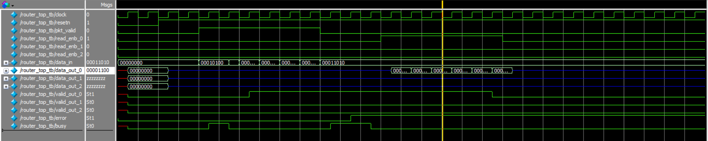

# 🚀 1×3 Packet Router using Verilog HDL



## 📖 Overview

This project implements a synthesizable **1×3 Packet Router** using **Verilog HDL**. The router receives packets through a single input interface and routes them to one of three output FIFOs based on the destination address. The design includes FSM-based control, FIFO buffering, synchronization logic, parity generation, and error detection.

---

## ✨ Features

- FSM-based Router Controller
- Three Independent FIFO Memories
- Synchronizer Module
- Register Module
- Packet Header Detection
- Parity Generation & Checking
- Error Detection
- Busy Signal Generation
- Soft Reset Logic
- Functional Verification using ModelSim
- RTL Synthesis using Intel Quartus Prime

---

## 🏗 RTL Design



---

## 📈 Simulation



---

## 📂 Repository Structure

```text
Verilog-1x3-Packet-Router
│
├── Source_Code
├── Testbench
├── RTL_Images
├── Simulation
├── Documentation
├── README.md
└── LICENSE
```

---

## 🛠 Tools Used

- Verilog HDL
- ModelSim
- Intel Quartus Prime Lite
- Quartus RTL Viewer

---

## 📚 Learning Outcomes

- RTL Design
- FSM Design
- FIFO Design
- Synchronizer Design
- Packet Routing
- Functional Verification
- RTL Synthesis

---

## 📄 Documentation

The complete project report is available in the **Documentation** folder.

---

## 👨‍💻 Author

**THEJ KRISHNA P.R**

B.Tech Electronics and Communication Engineering

Christ College of Engineering

Aspiring RTL / VLSI Engineer
